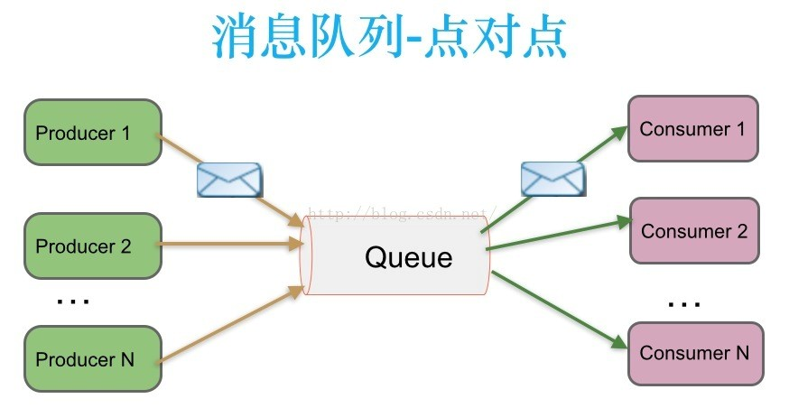
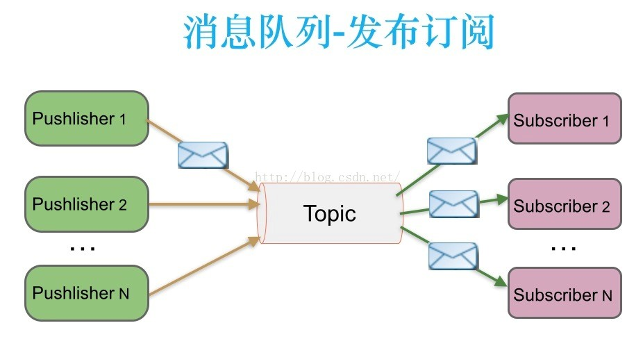
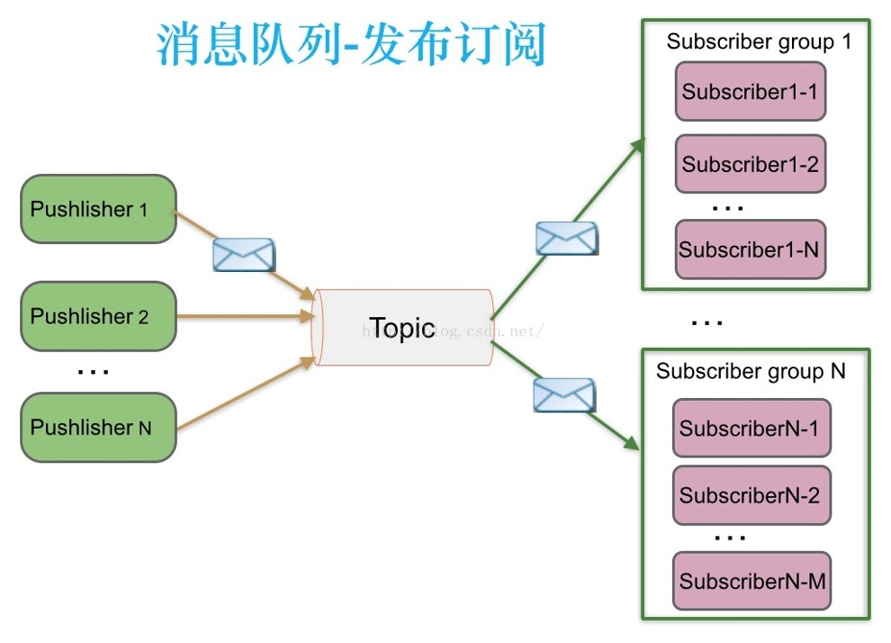
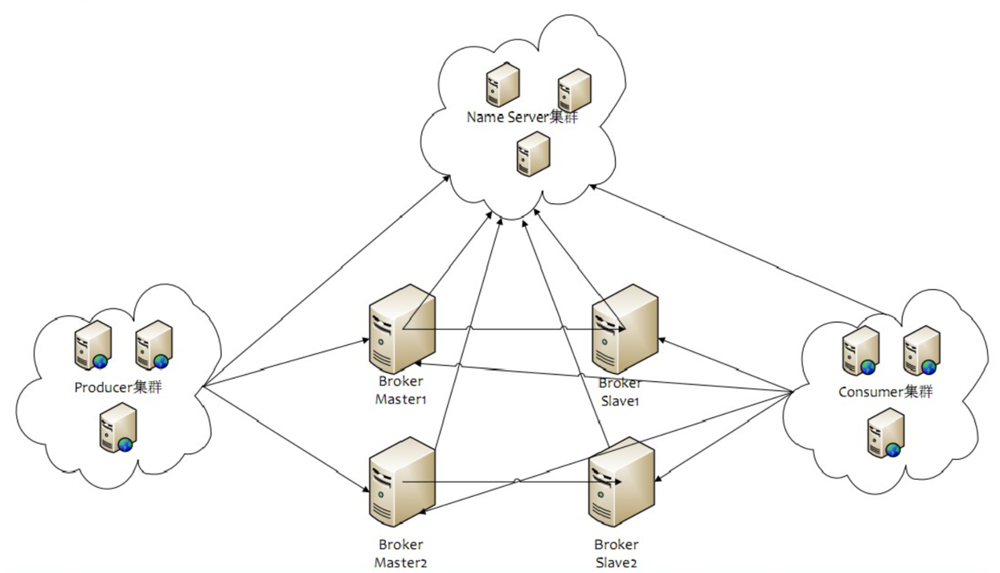
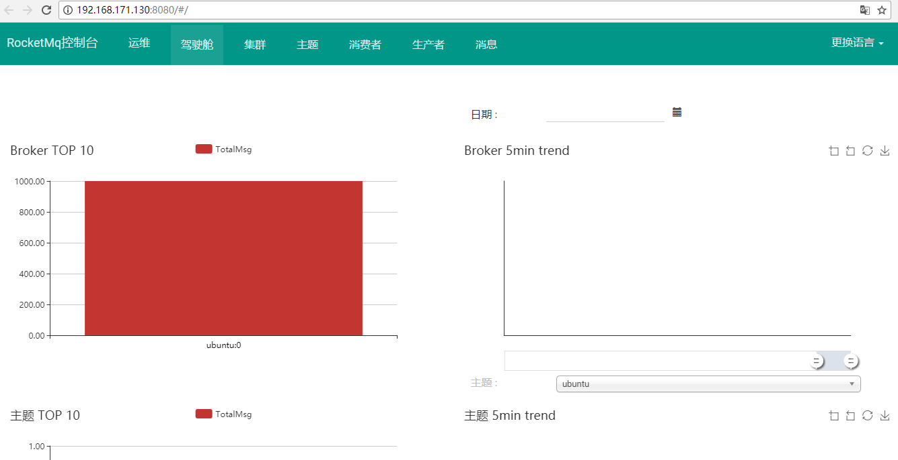

rocketmq
=================
&nbsp;&nbsp;&nbsp;&nbsp;rocketmq是一个纯java、分布式、队列模型的开源消息中间件，前身是metaq，当metaq 3.0发布时，产品名称改为rocketmq。

# 1. 消息中间件

&nbsp;&nbsp;&nbsp;&nbsp;传统的分布式对象调用应用广泛，但面对复杂的分布式系统，显示出一些局限性，比如模块间耦合度较高，同步通信延迟较高，消息中间件是一个中间层软件。消息队列中间件是分布式系统中重要的组件，主要解决应用解耦，异步消息，流量削锋等问题，实现高性能，高可用，可伸缩和最终一致性架构。

## 1.1 特点

- &nbsp;1.可靠性：基于消息的通信是可靠的，大多数消息中间件都提供将消息持久化到磁盘的功能，可以发送离线消息，消息不会丢失。在分布式事务中担当重要的角色。

- &nbsp;2.异步：基于事件驱动架构，将调用异步化。

- &nbsp;3.分布式：消息中间件都是分布式的。

- &nbsp;4.高效的数据分发:高效的算法，提高消息的吞吐率以及高效的消息投递路由。

## 1.2 应用场景

- &nbsp;1. 系统集成

&nbsp;&nbsp;&nbsp;&nbsp;系统集成，除了可以通过接口，还可以通过消息。两者不同在于接口是模块间直接调用,而有消息中间件的系统模块间通过消息模块通信，通过消息分解系统。

- &nbsp;2. 降低系统耦合性

&nbsp;&nbsp;&nbsp;&nbsp;如果模块之间不存在直接调用，那么修改或新增模块对其他模块影响最小。增加消息中间件后，业务模块仅需关注自己的业务逻辑和如何将消息发送给消息服务器，消息由中间件存储和分发。B宕机不会影响A，B系统瓶颈也不会成为A的瓶颈。也可以解决分布式事务问题。

&nbsp;&nbsp;&nbsp;&nbsp;直接接口调用存在的耦合（A调B）：

&nbsp;&nbsp;&nbsp;&nbsp;对于A：

&nbsp;&nbsp;&nbsp;&nbsp;&nbsp;&nbsp;&nbsp;&nbsp;1.存储要发送的消息,防止A或B宕机，信息丢失。

&nbsp;&nbsp;&nbsp;&nbsp;&nbsp;&nbsp;&nbsp;&nbsp;2.处理B的回调信息。

&nbsp;&nbsp;&nbsp;&nbsp;对于B：

&nbsp;&nbsp;&nbsp;&nbsp;&nbsp;&nbsp;&nbsp;&nbsp;1.设计接口通信协议，整合同构或异构的系统。

&nbsp;&nbsp;&nbsp;&nbsp;&nbsp;&nbsp;&nbsp;&nbsp;2.考虑系统的伸缩性，B的瓶颈会成为A的瓶颈，如何扩展。

&nbsp;&nbsp;&nbsp;&nbsp;&nbsp;&nbsp;&nbsp;&nbsp;3.保存回调消息，防止宕机造成消息丢失。

&nbsp;&nbsp;&nbsp;&nbsp;&nbsp;&nbsp;&nbsp;&nbsp;4.处理成功后通知A。

&nbsp;&nbsp;&nbsp;&nbsp;在分布式事务中，通过本地事务和消息服务器的配合，保证数据最终一致性。

- &nbsp;3. 改善系统性能

&nbsp;&nbsp;&nbsp;&nbsp;使用消息的异步调用，用户请求的数据发送给消息队列后立即返回，不用等接受者处理好数据，系统具有更好的响应延迟。在网站访问的高峰，消息中间件有一定的缓冲作用，减轻数据库和后端存储的负载压力。

- &nbsp;4. 跨平台

&nbsp;&nbsp;&nbsp;&nbsp;降低网络协议的复杂性。

- &nbsp;5. 提高系统可用性

&nbsp;&nbsp;&nbsp;&nbsp;基于消息的通信是可靠的，消息不会丢失。可以发送事务性消息，而且大多数消息中间件都提供将消息持久化到磁盘的功能。

- &nbsp;6. 流量削峰

&nbsp;&nbsp;&nbsp;&nbsp;流量削锋也是消息队列中的常用场景，一般在秒杀或团抢活动中使用广泛。应用场景：秒杀活动，一般会因为流量过大，导致流量暴增，应用挂掉。为解决这个问题，一般需要在应用前端加入消息队列。可以做到：1）可以控制活动的人数；2）可以缓解短时间内高流量压垮应用。

## 1.3 引入消息中间件需要注意的地方

- &nbsp;1. 复杂性

&nbsp;&nbsp;&nbsp;&nbsp;消息中间件都是分布式的，引入分布式会大大增加系统复杂度，在不同主机、不同进程之间的调用和调试，会带来更多的不稳定性。分布式系统还会增加对外部系统的依赖。即使自己的系统没有问题，也可能会因为依赖系统出问题而导致系统不稳定。

- &nbsp;2. 异步调用

&nbsp;&nbsp;&nbsp;&nbsp;带来的业务交互的改变，有一定的操作延迟。

- &nbsp;3. 同步调用

&nbsp;&nbsp;&nbsp;&nbsp;尽管消息中间件也可用于同步调用，但这并不是它的长项，同步调用可以考虑使用HTTP、NIO等其他方式。

## 1.3 消息模型

- &nbsp;1. 点对点

- &nbsp;2. 发布订阅-单一消费场景

- &nbsp;3. 发布订阅-多种消费场景

# 2. rocketmq基本概念

<table>
  <tr>
    <th width=40%, bgcolor=yellow >概念</th>
    <th width=60%, bgcolor=yellow>说明</th>
  </tr>
  <tr>
    <td bgcolor=#eeeeee> Producer  </td>
    <td> 消息生产者，负责产生消息，一般由业务系统负责产生消息 </td>
  </tr>
  <tr>
    <td bgcolor=#eeeeee> Consumer  </td>
    <td> 消息消费者，负责消费消息，一般是后台系统负责异步消费 </td>
  </tr>
  <tr>
    <td bgcolor=#eeeeee> Push Consumer  </td>
    <td> Consumer的一种，应用通常向Consumer对象注册一个Listener接口，一旦收到消息，Consumer对象立刻回调Listener接口方法 </td>
  </tr>
  <tr>
    <td bgcolor=#eeeeee> Pull Consumer  </td>
    <td> Consumer的一种，应用通常主动调用Consumer的拉消息方法从Broker拉消息，主动权由应用控制 </td>
  </tr>
  <tr>
    <td bgcolor=#eeeeee> Producer Group  </td>
    <td> 一类Producer的集合名称，这类Producer通常发送一类消息，且发送逻辑一致 </td>
  </tr>
  <tr>
    <td bgcolor=#eeeeee> Consumer Group  </td>
    <td> 一类Consumer的集合名称，这类Consumer通常消费一类消息，且消费逻辑一致 </td>
  </tr>
  <tr>
    <td bgcolor=#eeeeee> Broker  </td>
    <td> 消息中转角色，负责存储消息，转发消息，一般也称为Server </td>
  </tr>
   <tr>
      <td bgcolor=#eeeeee> Name Server  </td>
      <td> rocketmq名称服务器，更新和发现 broker服务 </td>
    </tr>
   <tr>
      <td bgcolor=#eeeeee> Broker Master  </td>
      <td> broker 消息主机服务器 </td>
    </tr>
   <tr>
      <td bgcolor=#eeeeee> Broker Slave  </td>
      <td> broker 消息从机服务器 </td>
    </tr>
</table>

# 3. rocketmq部署架构

- &nbsp;1. NameServer是一个几乎无状态的节点，可集群部署，节点之间无任何信息同步。

- &nbsp;2. Broker部署相对复杂，Broker分Master与Slave，一个Master可以对应多个Slaver，但是一个Slaver只能对应一个Master，Master与Slaver的对应关系通过指定相同的BrokerName，不同的BrokerId来定义，BrokerId为0表示Master，非0表示Slaver。Master可以部署多个。每个Broker与NameServer集群中的所有节点建立长连接，定时注册Topic信息到所有的NameServer。

- &nbsp;3. Producer与NameServer集群中的其中一个节点（随机选择）建立长连接，定期从NameServer取Topic路由信息，并向提供Topic服务的Master建立长连接，且定时向Master发送心跳。Produce完全无状态，可集群部署。

- &nbsp;4. Consumer与NameServer集群中的其中一个节点（随机选择）建立长连接，定期从NameServer取Topic路由信息，并向提供Topic服务的Master、Slaver建立长连接，且定时向Master、Slaver发送心跳。Consumer即可从Master订阅消息，也可以从Slave订阅消息，订阅规则由Broker配置决定。

# 4. rocketmq快速上手

&nbsp;&nbsp;&nbsp;&nbsp;rocketmq是一个纯java、分布式、队列模型的开源消息中间件，搭建部署rocketmq我是使用源码自己打包的，另外rocketmq-consule方便运维rocketmq，也是从源码打包的，下面简述流程。

## 4.1 前提依赖

- &nbsp;1.linux环境（我使用的是ubuntu-17.04-server-amd64.iso，使用虚拟机vmware，安装了vmware tools、ssh（使用其他console多窗口访问比较方便，建议安装）、net、tar、zip等相关工具）；

- &nbsp;2.java环境搭建（我安装的是java-1.8.0-openjdk-amd64，安装maven环境Apache Maven 3.3.9）。

## 4.2 rocketmq中间件编译

- &nbsp;1.[rocketmq官方](http://rocketmq.apache.org/)下载rocketmq源码（我下载的是4.2.0版本）；

- &nbsp;2. 解压rocketmq-all-4.2.0-source-release.zip文件：
~~~sh
unzip ~/workspace/env/rocketmq/rocketmq-all-4.2.0-source-release.zip
~~~

- &nbsp;3. 进入rocketmq-all-4.2.0目录：
~~~sh
cd rocketmq-all-4.2.0/
~~~

- &nbsp;4. maven构建rocketmq（跳过单元测试，构建成发布版本）：
~~~sh
mvn -Prelease-all -DskipTests clean install -U
~~~

- &nbsp;5. 构建完成后，构建成的rocketmq在路径：
~~~sh
cd distribution/target/apache-rocketmq
~~~

## 4.3 rocketmq最简单部署测试

&nbsp;&nbsp;&nbsp;&nbsp;构建rocketmq完成后，可以测试一下rocketmq是否有问题，分别启动NameServer、启动单个Master。

- &nbsp;1.启动NameServer，日志文件在~/logs/rocketmqlogs/namesrv.log下面，若显示“The Name Server boot success...”表示启动成功：
~~~sh
nohup sh bin/mqnamesrv &
~~~

- &nbsp;2.启动单个Broker，日志文件在~/logs/rocketmqlogs/broker.log下面，若显示“The broker\[...\] boot success...”表示启动成功：
~~~sh
nohup sh bin/mqbroker -n localhost:9876 &
~~~

## 4.4 测试发布消息与接受

&nbsp;&nbsp;&nbsp;&nbsp;rocketmq编译好的模块里面，有测试发送与接受消息的工具，工具是从环境变量取的NameServer地址。

- &nbsp;1.设置NameServer地址到环境变量中：
~~~sh
export NAMESRV_ADDR=localhost:9876
~~~

- &nbsp;2.测试发送消息，若sendStatus=SEND_OK表示发送成功：
~~~sh
sh bin/tools.sh org.apache.rocketmq.example.quickstart.Producer
~~~

- &nbsp;3.测试消费消息：
~~~sh
sh bin/tools.sh org.apache.rocketmq.example.quickstart.Consumer
~~~

## 4.5 rocketmq-console运维平台构建

&nbsp;&nbsp;&nbsp;&nbsp;rocketmq提供控制台运维平台，在开源项目rocketmq-externals的子模块rocketmq-console中，使用spring boot开发的，可以从[github地址](https://github.com/apache/rocketmq-externals)下载。

- &nbsp;1.命令进入rocketmq-console子目录，通过maven对其编译打包：
~~~sh
mvn package
~~~

- &nbsp;2.构建完成后，在目录rocketmq-console/target会生成一个rocketmq-console-ng-1.0.0.jar的包。

- &nbsp;3.启动spring boot编码生成的包rocketmq-console-ng-1.0.0.jar，启动后，运维界面详细件下图所示：
~~~sh
nohup java -jar rocketmq-console-ng-1.0.0.jar --server.port=12581 --rocketmq.config.namesrvAddr=localhost:9876
~~~

