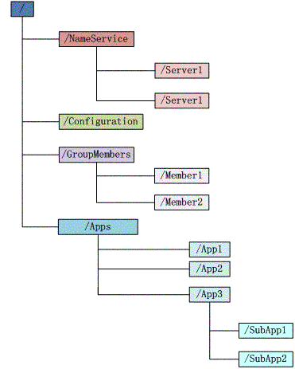

zookeeper
=================
&nbsp;&nbsp;&nbsp;&nbsp;zookeeper是一个分布式的，开放源码的分布式应用程序协调服务，它包含一个简单的原语集，分布式应用程序可以基于它实现同步服务，配置维护和命名服务等。在分布式应用中，需要有一种可靠的、可扩展的、分布式的、可配置的协调机制来统一系统的状态，zookeeper目的就在于此。zookeeper从设计模式角度来看，是一个基于观察者模式设计的分布式服务管理框架，它负责存储和管理大家都关心的数据，然后接受观察者的注册，一旦这些数据的状态发生变化，zookeeper就将负责通知已经在 Zookeeper 上注册的那些观察者做出相应的反应。

# 1. zookeeper安装

## 1.1 独立模式（standalone）

- 1.解压下载的压缩包zookeeper.tar.gz，进入conf目录，复制一份zoo_sample.cfg配置文件，命名为zoo.cfg，修改配置文件：
~~~txt
tickTime=2000
initLimit=10
syncLimit=5
dataDir=/home/xqhuang/workspace/env/zk/zk1/data
clientPort=2181
~~~ 

- 2.进入bin目录，启动zookeeper：
~~~sh
./zkServer.sh start
~~~

- 3.客户端连接zookeeper：
~~~sh
./zkCli.sh -server 127.0.0.1:2181
~~~

## 1.2 复制模式（replicated）
&nbsp;&nbsp;&nbsp;&nbsp;使用单机搭建伪集群模式的zookeeper集群。zookeeper通过复制来实现高可用性,只要集合体中半数以上的机器处于可用状态,它就能够保证服务继续。

- 1.搭建3个zookeeper节点，解压下载的压缩包zookeeper.tar.gz，复制三份，分别放在同一个目录下，复制zoo_sample.cfg配置文件，重命名为zoo.cfg，修改配置文件分别如下：

&nbsp;&nbsp;&nbsp;&nbsp;第一个节点：
~~~txt
tickTime=2000
initLimit=10
syncLimit=5
clientPort=2181
dataDir=/home/xqhuang/workspace/env/zk/zk2/zk1
server.1=localhost:2887:3887
server.2=localhost:2888:3888
server.3=localhost:2889:3889
~~~ 

&nbsp;&nbsp;&nbsp;&nbsp;第二个节点：
~~~txt
initLimit=10
syncLimit=5
clientPort=2182
dataDir=/home/xqhuang/workspace/env/zk/zk2/data/zk2
server.1=localhost:2887:3887
server.2=localhost:2888:3888
server.3=localhost:2889:3889
~~~ 

&nbsp;&nbsp;&nbsp;&nbsp;第三个节点：
~~~txt
initLimit=10
syncLimit=5
clientPort=2183
dataDir=/home/xqhuang/workspace/env/zk/zk2/data/zk3
server.1=localhost:2887:3887
server.2=localhost:2888:3888
server.3=localhost:2889:3889
~~~ 

&nbsp;&nbsp;&nbsp;&nbsp;配置项说明如下：

<table>
  <tr>
    <th width=20%, bgcolor=yellow >参数</th>
    <th width=80%, bgcolor=yellow>说明</th>
  </tr>
  <tr>
    <td bgcolor=#eeeeee> initLimit </td>
    <td> 这个配置项是用来配置 Zookeeper接受客户端（这里所说的客户端不是用户连接 Zookeeper服务器的客户端，而是 Zookeeper 服务器集群中连接到 Leader 的 Follower 服务器）初始化连接时最长能忍受多少个心跳时间间隔数。当已经超过 10 个心跳的时间（也就是 tickTime）长度后 Zookeeper 服务器还没有收到客户端的返回信息，那么表明这个客户端连接失败。总的时间长度就是 5*2000=10 秒  </td>
  </tr>
  <tr>
    <td bgcolor=#00FF00> syncLimit </td>
    <td> 这个配置项标识 Leader 与 Follower 之间发送消息，请求和应答时间长度，最长不能超过多少个 tickTime 的时间长度，总的时间长度就是 2*2000=4 秒 </td>
  </tr>
  <tr>
    <td bgcolor=rgb(0,10,0)> dataDir </td>
    <td>  顾名思义就是 Zookeeper 保存数据的目录，默认情况下，Zookeeper 将写数据的日志文件也保存在这个目录里 </td>
  </tr>
  <tr>
      <td bgcolor=rgb(0,10,0)> clientPort </td>
      <td>  这个端口就是客户端连接 Zookeeper 服务器的端口，Zookeeper 会监听这个端口，接受客户端的访问请求 </td>
    </tr>
</table>

- 2.如果直接启动zk节点会报错的，需要创建相应data的目录，创建完了后，分别创建三个myid文件，分别位于每个节点的dataDir下面，填充的值分别为1、2、3。

- 3.分别进入bin目录，启动三个zookeeper：
~~~sh
./zkServer.sh
~~~

- 4.测试集群同步，分别用三个客户端连接三个节点：

&nbsp;&nbsp;&nbsp;&nbsp;客户端连接第一个节点：
~~~sh
./zkCli.sh -server 127.0.0.1:2181
~~~

&nbsp;&nbsp;&nbsp;&nbsp;客户端连接第二个节点：
~~~sh
./zkCli.sh -server 127.0.0.1:2182
~~~

&nbsp;&nbsp;&nbsp;&nbsp;客户端连接第三个节点：
~~~sh
./zkCli.sh -server 127.0.0.1:2183
~~~

&nbsp;&nbsp;&nbsp;&nbsp;在第一个节点的客户端中添加一个node：
~~~sh
create /test 123
~~~

&nbsp;&nbsp;&nbsp;&nbsp;在第二个节点的客户端可以查看到第一个节点添加的node：
~~~sh
ls /
~~~

# 2. zookeeper与java的连接

## 2.1 maven依赖

&nbsp;&nbsp;&nbsp;&nbsp;pom依赖如下,version根据你的实际情况选择：
~~~xml
<dependency>
    <groupId>org.apache.zookeeper</groupId>
    <artifactId>zookeeper</artifactId>
    <version>${version}</version>
</dependency>
~~~

## 2.2 java使用用例

&nbsp;&nbsp;&nbsp;&nbsp;使用zookeeper的java方式，使用代码描述，不详细说明。
~~~java
package com.wx.zookeeper;

import org.apache.zookeeper.*;
import org.apache.zookeeper.data.Stat;

import java.util.concurrent.ExecutorService;
import java.util.concurrent.Executors;

/**
 * zookeeper简单测试
 *
 * @author xinquan.huangxq
 */
public class StandaloneTest {

    private static final ZooKeeper zk;

    private static final boolean isStandalone = false;

    static {
        try {
            if (isStandalone) {
                zk = new ZooKeeper("192.168.171.130:2181", 30000, new TestWatcher());
            } else {
                zk = new ZooKeeper("192.168.171.130:2181,192.168.171.130:2182,192.168.171.130:2183", 30000, new TestWatcher());
            }
            System.out.println("zk connect");
        } catch (Throwable e) {
            throw new RuntimeException(e);
        }
    }

    public static void main(String[] args) throws KeeperException, InterruptedException {
        ExecutorService executorService = Executors.newSingleThreadExecutor();
        executorService.execute(new Runnable() {
            public void run() {
                try {
                    Stat stat;
                    do {
                        stat = zk.exists("/test", true);
                        Thread.sleep(1000);
                    } while (stat != null);

                    zk.close();
                    System.out.println("zk close");
                } catch (Throwable e) {
                    e.printStackTrace();
                }
            }
        });
        executorService.shutdown();
    }

    private static class TestWatcher implements Watcher {

        public void process(WatchedEvent watchedEvent) {
            StringBuilder sb = new StringBuilder();
            sb.append("path").append(":").append(watchedEvent.getPath()).append(" ")
                    .append("type").append(":").append(watchedEvent.getType()).append(" ")
                    .append("stat").append(":").append(watchedEvent.getState()).append(" ");
            System.out.println(sb.toString());
        }
    }
}
~~~

# 3. zookeeper深入理解

&nbsp;&nbsp;&nbsp;&nbsp;zookeeper最重要的就是类似于文件系统的数据结构和通知机制。

# 3.1 文件系统

&nbsp;&nbsp;&nbsp;&nbsp;zookeeper维护一个类似文件系统的数据结构：

&nbsp;&nbsp;&nbsp;&nbsp;每个子目录项如NameService都被称作为znode，和文件系统一样，我们能够自由的增加、删除znode，在一个znode下增加、删除子znode，唯一的不同在于znode是可以存储数据的。

&nbsp;&nbsp;&nbsp;&nbsp;有四种类型的znode：

- &nbsp;&nbsp;&nbsp;&nbsp;持久化目录节点：客户端与zookeeper断开连接后，该节点依旧存在。
- &nbsp;&nbsp;&nbsp;&nbsp;持久化顺序编号目录节点：客户端与zookeeper断开连接后，该节点依旧存在，只有zookeeper给该节点名称进行顺序编号。
- &nbsp;&nbsp;&nbsp;&nbsp;临时目录节点：客户端与zookeeper断开连接后，该节点会被删除。
- &nbsp;&nbsp;&nbsp;&nbsp;临时顺序编号目录节点：客户端与zookeeper断开连接后，该节点会被删除，只是zookeeper给该节点名称进行顺序编号。

# 3.2 通知机制

&nbsp;&nbsp;&nbsp;&nbsp;客户端注册监听它关心的目录节点，当目录节点发生变化后（数据更改、被删除、子目录节点增加删除）时，zookeeper会通知客户端。

# 4. zookeeper服务

# 4.1 命名服务

&nbsp;&nbsp;&nbsp;&nbsp;命名服务就是提供名称的服务，zookeeper的命名服务有两个应用方面。一个是提供类似JNDI功能，另一个是制作分布式的序列号生成器。

- &nbsp;&nbsp;&nbsp;&nbsp;JNDI功能，我们利用Zookeeper的分层结构，可以把系统中的各种服务的名称、地址、以及目录信息存放在Zookeeper中，需要的时候去Zookeeper中读取。

- &nbsp;&nbsp;&nbsp;&nbsp;利用Zookeeper循序节点的特性，制作分布式的序列号生成器，或者叫id生成器。（分布式环境下使用作为数据库id，另外一种是UUID（缺点：没有规律）），Zookeeper可以生成有顺序的容易理解的同时支持分布式环境的编号。 

# 4.2 配置管理

&nbsp;&nbsp;&nbsp;&nbsp;zookeeper可以集中配置应用程序的配置项，将其配置在各个目录节点上面，然后应用程序对这个目录节点进行监听，当配置发生变更时候，应用会接受到zookeeper的通知，然后从zookeeper获取新的配置，并且可以触发一些行为。

# 4.3 集群管理

&nbsp;&nbsp;&nbsp;&nbsp;集群管理主要在于两个方面：是否有机器退出和加入、选举master。

- &nbsp;&nbsp;&nbsp;&nbsp;对于第一点，所有机器约定在父目录GroupMembers下创建临时目录节点，然后监听父目录节点的子节点变化消息。一旦有机器挂掉，该机器与zookeeper的连接断开，其所创建的临时目录节点被删除，所有其他机器都收到通知：某个兄弟目录被删除，于是，所有人都知道。新机器加入也是类似，所有机器收到通知：新兄弟目录加入，highcount又有了。

- &nbsp;&nbsp;&nbsp;&nbsp;对于第二点，我们稍微改变一下，所有机器创建临时顺序编号目录节点，每次选取编号最小的机器作为master就好。

# 4.4 分布式锁

&nbsp;&nbsp;&nbsp;&nbsp;有了zookeeper的一致性文件系统，锁的问题变得容易。锁服务可以分为两类，一个是保持独占，另一个是控制时序。

- &nbsp;&nbsp;&nbsp;&nbsp;对于第一类，我们将zookeeper上的一个znode看作是一把锁，通过createznode的方式来实现。所有客户端都去创建 /distribute_lock节点，最终成功创建的那个客户端也即拥有了这把锁。用完删除掉自己创建的distribute_lock节点就释放出锁。

- &nbsp;&nbsp;&nbsp;&nbsp;对于第二类，/distribute_lock已经预先存在，所有客户端在它下面创建临时顺序编号目录节点，和选master一样，编号最小的获得锁，用完删除，依次方便。

# 4.5 队列管理

&nbsp;&nbsp;&nbsp;&nbsp;有两种类型的队列：一个是同步队列，当一个队列的成员都聚齐时，这个队列才可用，否则等待所有成员到达；另一个是按照FIFO方式进入队列和出队操作。

- &nbsp;&nbsp;&nbsp;&nbsp;对于第一类，在约定目录下创建临时目录节点，监听节点数目是否是我们要求的数目。

- &nbsp;&nbsp;&nbsp;&nbsp;对于第二类，和分布式锁服务中的控制时序场景基本原理一致，入列有编号，出列按编号。

 
